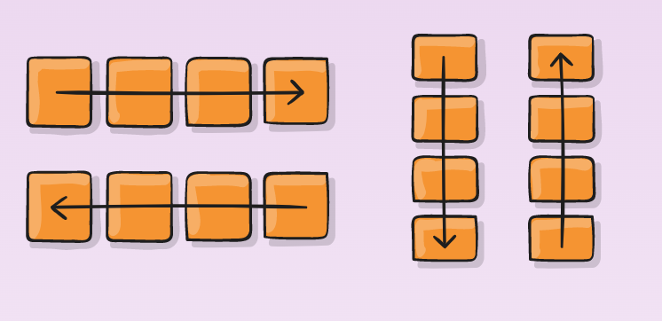
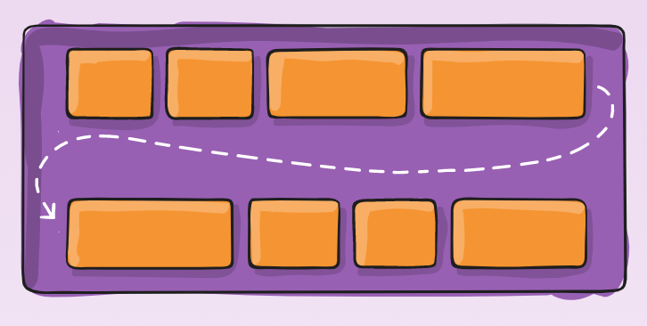
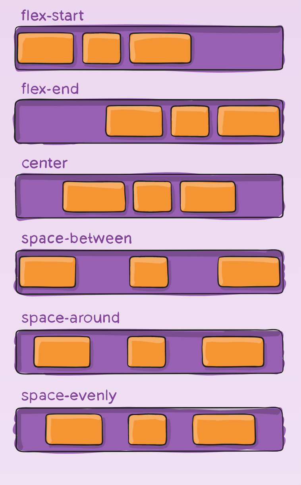
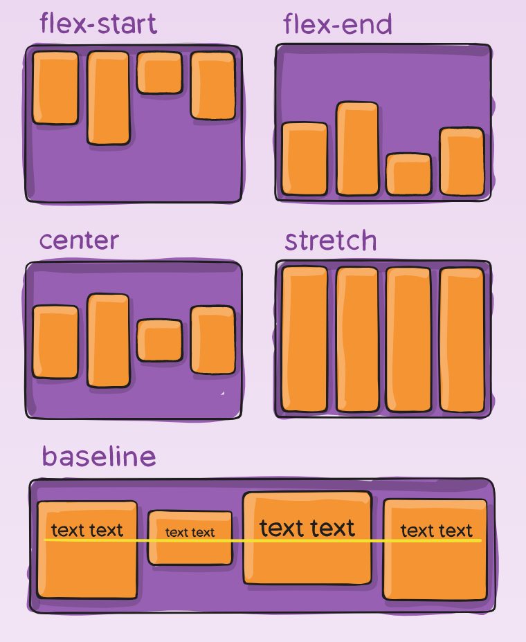
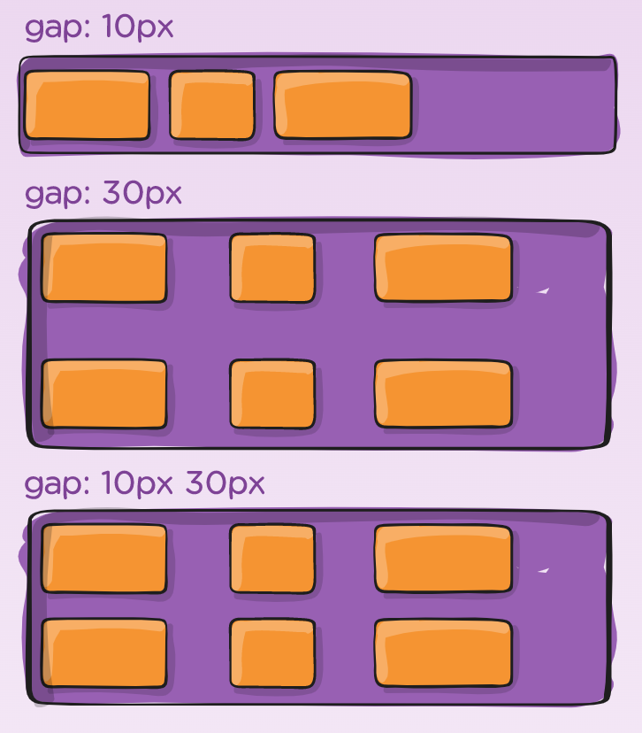
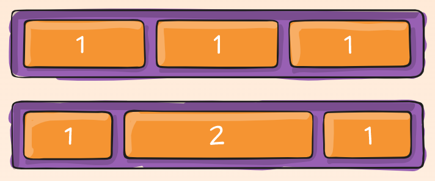
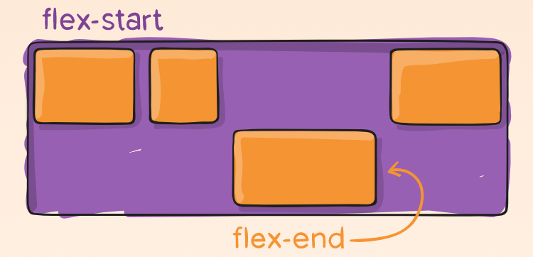

<h1 align="center"> Flexbox</h1>

<p align="center">
Se creó para mejorar la forma en la que se hace el diseño responsivo, evitando así el uso de float, escribiendo menos código y facilitando el posicionamiento de elementos.
</p>

<!--  -->

## Estructura de Flex Container


## Propiedades para el padre (flex container)

### display

Define un contenedor flexible; en línea o bloque

```css
.container {
  display: flex; /* or inline-flex */
}
```


### flex-direction

Define la dirección en que se colocan los artículos flexibles en el contenedor flexible.

```css
.container {
  flex-direction: row; /* or row-reverse | column | column-reverse */
}
```



### flex-wrap

Los elementos se ajusten según sea necesario con esta propiedad.

```css
.container {
  flex-wrap: wrap; /* or wrap-reverse | nowrap */
}
```



### justify-content

Define la alineación a lo largo del eje principal (main axis | cross axis)

```css
.container {
  justify-content: flex-start;
  /* or flex-end | center | space-between | space-around | space-evenly | start | end | left | right ... + safe | unsafe */
}
```



### align-items

Define cómo se distribuyen los elementos flexibles

```css
.container {
  align-items: stretch;
  /* flex-start | flex-end | center | baseline | first baseline | last baseline | start | end | self-start | self-end + ... safe | unsafe */
}
```



### align-content

Alinea las líneas de un contenedor flexible dentro cuando hay espacio adicional en el eje transversal.

```css
.container {
  align-content: flex-start;
  /* flex-end | center | space-between | space-around | space-evenly | stretch | start | end | baseline | first baseline | last baseline + ... safe | unsafe; */
}
```


### gap, row-gap, column-gap

Controla el espacio entre elementos flexibles

```css
.container {
  display: flex;
  ...
  gap: 10px;
  gap: 10px 20px; /* row-gap column gap */
  row-gap: 10px;
  column-gap: 20px;
}
```



## Propiedades para el hijo (flex items)

### order

La propiedad order controla el orden en que aparecen en el contenedor flexible.

```css
.item {
  order: 5; /* default is 0 */
}
```


### flex-grow

Define la capacidad de crecimiento de un elemento flexible si es necesario.

```css
.item {
  flex-grow: 4; /* default 0 */
}
```



### flex-shrink

Define la capacidad de que un elemento flexible se encoja si es necesario.

```css
.item {
  flex-shrink: 3; /* default 1 */
}
```

### flex-basis

Es la abreviatura de flex-grow, flex-shrink y flex-basis combinados.

```css
.item {
  flex: none | [ < "flex-grow" > < "flex-shrink" >? || < "flex-basis" > ];
}
```

### align-self

Permite anular la alineación predeterminada para elementos flexibles individuales.

```css
.item {
  align-self: auto;
  /* flex-start | flex-end | center | baseline | stretch */
}
```


