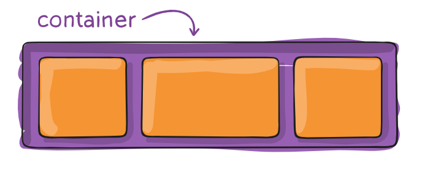
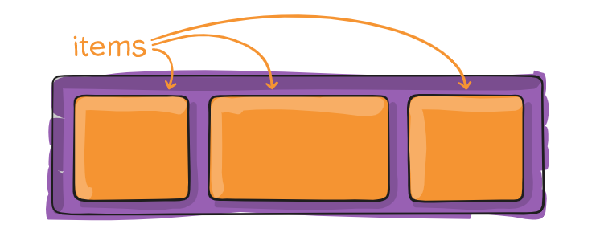

<h1 align="center"> Flexbox</h1>

Se creó para mejorar la forma en la que se hace el diseño responsivo, evitando así el uso de float, escribiendo menos código y facilitando el posicionamiento de elementos.

<!--  -->

## Estructura de Flex Container

## Propiedades para el padre (flex container)

## Propiedades para el hijo (flex items)

